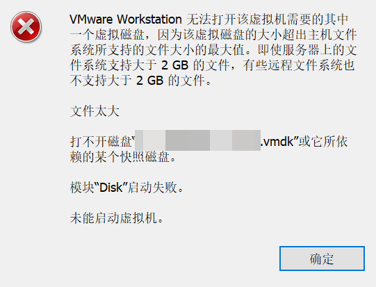
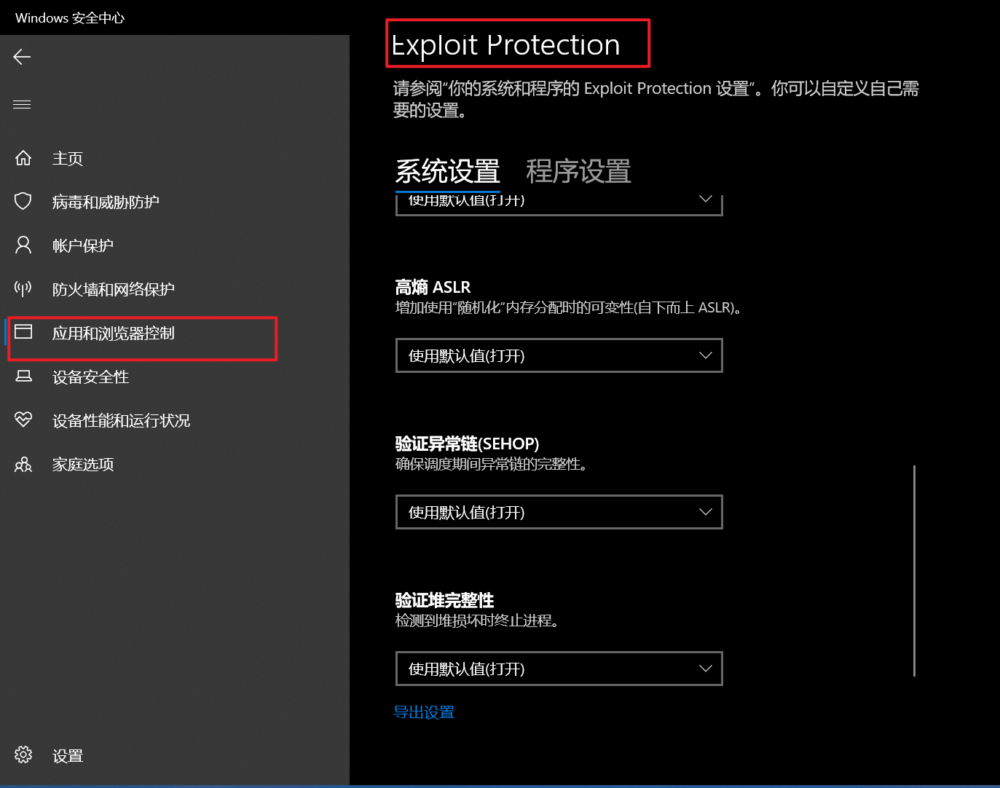

# VMware 虚拟磁盘报错“The file is too large”，原因也可能是修改了 Exploit Protection

## 具体问题

使用 VMware Workstation 运行虚拟机，无法正常加载虚拟磁盘，出现错误：“The file is too large”（文件过大）。相同虚拟磁盘文件在其他机器无异常。

## 环境说明

- 操作系统为 Windows 10 Pro 22H2，使用 VMware Workstation 17.6.4 运行虚拟机
- 虚拟磁盘文件所在文件系统为 *btrfs*（通过 [WinBtrfs 1.9](https://github.com/maharmstone/btrfs) 挂载）
- 关闭了 Windows Defender （Windows 安全中心） 中 Exploit Protection 的所有保护选项
- 虚拟磁盘文件权限正常，无杀软干扰，也与杀软没有直接关联

目前仅发现在上述环境中出现该错误，如果你出现错误的环境与以上描述不符，那么下列修复方法并不适用你。

## 恢复方法

将 Windows Defender 中 Exploit Protection 的所有保护选项恢复为默认选项

## 更多信息

未测试 Exploit Protection 中选项对 Vmware Workstation 的具体影响。
